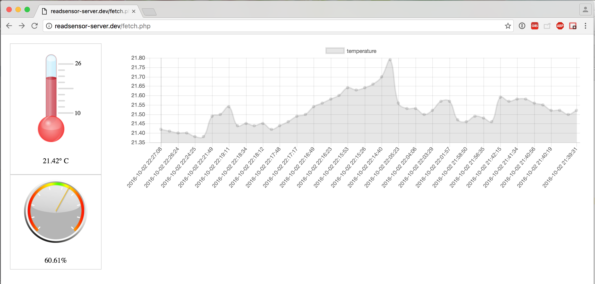

# thermohygro
Thermometer and hygrometer through Raspberry PI &amp; SHT15

## About
This is a work in progress to have a very simple still reliable hygrometry and temperature autonom reader.
The final aim is to integrate simple conservation constants for a museum archive room, directly inside CollectiveAccess, under a storage location record and through widget alerts.

## Stage

## Todo
[ ] Document the crontab operation
[ ] Have a decimation process to keep only step measures (maybe 24/day when older than a week, keep only weekly week average measures when older than one year)
[ ] Have a webservice and an information bundle inside CollectiveAccess
[ ] Have a dashboard widget inside CollectiveAccess
